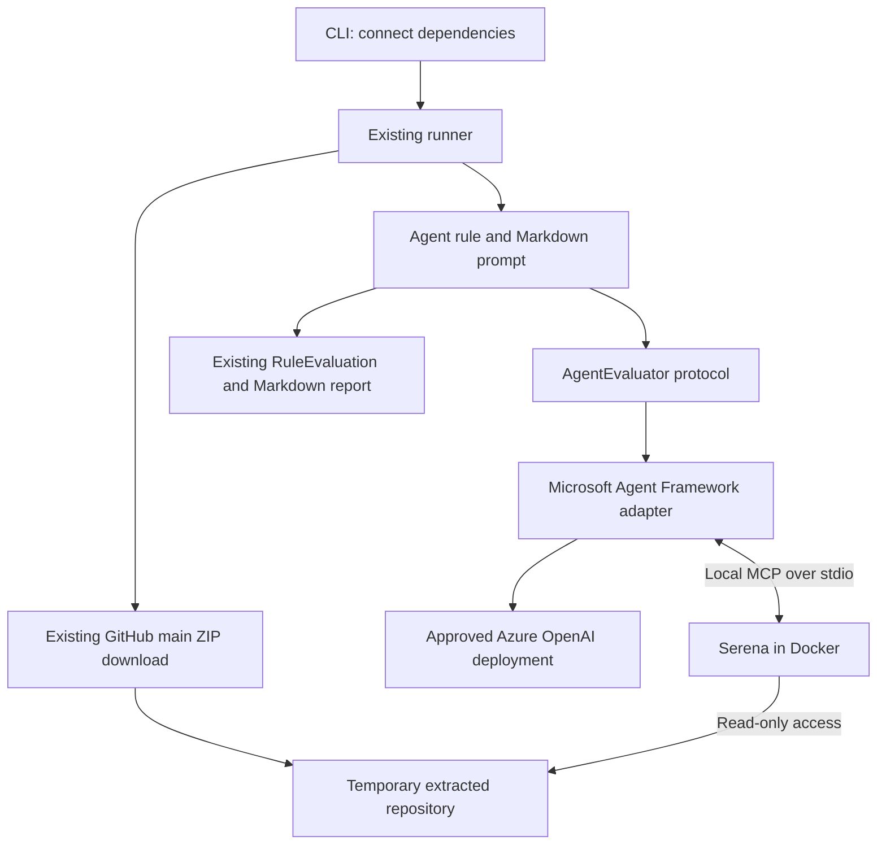

# Task

I would like to implement a check for the following rule...

> The repository has a continuous integration workflow that runs for every pull request to main branch.

Confirming adherance to this rule requires broader reasoning across the repository, where an AI model/agent makes a judgment, rather than one that can be tested deterministically.

This is the first agent rule in this codebase. Here are the tech stack decisions, but we should make it easy to swap these if our decisions later change. We don't want to be locked in. For example, Microsoft Agent Frameowrk may change to Pydantic AI; oraios/serena may change to modelcontextprotocol/server-filesystem etc.

Model / inference provider, i.e. which LLM actually does the reasoning:
Answer: Azure OpenAI deployment.

Agent framework, i.e. what handles the tool loop?
Answer: Microsoft Agent Framework

Tool protocol, i.e. how are tools exposed?
Answer: MCP

MCP transport, i.e. how does agent communicate with the MCP server
Answer: `stdio`.

MCP server, i.e. what tools should the agent have?
Answer: @oraios/serena

Output schema, i.e. how is result represented?
Answer: Structured output, not arbitrary prose.

# Design Decisions
- Authentication to Azure resources via Microsoft Entra ID. For GitHub Runner, use Federated OIDC Login; for local runs, use `az login`/`AzureCliCredential`.
- For security, the MCP server is run inside a Docker container with read-only permissions and mounts the extracted repository directory.
- Prompts given to the agent are always within a Markdown file that is loaded.
- Your returned plan must include an indicative architecture.
- Data is permitted to go to our approved Azure OpenAI resource and that which is necessary for the GitHub REST API, but nowhere else. We must not connect to external MCP servers; local solutions only.

# Implementation Plan

Add `ci-workflow-on-pull-requests`: an agent reads the existing local `main` snapshot and judges whether a CI workflow declares that it runs on pull requests targeting `main`.

Keep the check narrow. GitHub Actions only; local source only. Build, tests, lint, type checks, or static analysis count as CI. Use existing reporting and exemptions.

## Indicative architecture



## Implementation

- **Rule and prompt:** Add the rule under `rules/agentic/`, with its prompt in an adjacent Markdown resource loaded independently of the working directory. Register it with category `AGENTIC`, confidence `MEDIUM`, and `requires_source_snapshot=True`.
- **Judgment:** Inspect workflow declarations and relevant local files to identify meaningful CI. An unrestricted pull-request trigger includes `main`. Return `PASS` for a qualifying workflow, `FAIL` when absent or incompatible, and `ERROR` when evidence is insufficient. Keep policy in the prompt; do not build a separate workflow interpreter or expand into a runtime audit.
- **Small integration boundary:** Add `AgentEvaluator.evaluate(snapshot_path: Path, prompt: str) -> RuleEvaluation` to existing ports. Supply it through the runner and `RuleContext`. Keep the synchronous checker; contain asynchronous framework calls inside the adapter.
- **Structured result:** Request a Pydantic schema containing `verdict` (`pass`, `fail`, `uncertain`), a short explanation, and evidence using existing `path`, `line`, and `marker` fields. Validate it before conversion to existing domain types. Microsoft Agent Framework supports Pydantic response formats. [Structured-output documentation](https://learn.microsoft.com/en-us/agent-framework/agents/structured-outputs)
- **Failure handling:** Add `AgentError` to expected per-rule failures. Uncertainty, invalid output, authentication failure, unavailable Docker/MCP, and a 120-second evaluation timeout produce `ERROR`; remaining checks continue. Start agent resources only when an active rule needs them.
- **Replaceability:** Keep framework imports inside the adapter. Isolate Azure client construction and Serena launch settings in small functions. Replacing the framework changes the adapter; replacing Serena changes launch settings and allowed tools.

## Runtime and setup

- Safely extract the existing ZIP into a temporary directory, validating paths and rejecting unsafe entries. Keep extraction and cleanup inside the integration.
- Run Serena through `MCPStdioTool` using Docker: read-only container filesystem and repository mount, `--network none`, and separate temporary writable state. Expose only file listing, reading, and searching. Use checker-owned configuration, with repository-supplied Serena configuration inactive; disable dashboard, shell, editing, REPL, and language-server startup. Serena supports configurable tool sets and separate project state. [Serena configuration](https://oraios.github.io/serena/02-usage/050_configuration.html)
- Keep credentials outside the container. Send repository content only to the configured approved Azure OpenAI endpoint; enable no external telemetry or remote MCP connections.
- Use `AzureCliCredential`: developers authenticate with `az login`; GitHub Actions first runs `azure/login@v3` with federated OIDC and `id-token: write`. Document the identity’s required Azure role and federated credential. [Azure Login documentation](https://github.com/Azure/login)
- Validate Azure endpoint, deployment, and API-version settings through Pydantic settings. Pass Azure routing explicitly to the framework client. Assume the approved deployment already exists and supports tool calling and structured output. [Microsoft client guidance](https://learn.microsoft.com/en-us/agent-framework/support/upgrade/python-2026-significant-changes)
- Add required framework, MCP, Azure Identity, and settings dependencies; update `uv.lock` and pin the Serena image. Update setup and architecture documentation. Preserve existing CLI arguments and report format.

## Verification

- Test structured-result conversion, invalid output, uncertainty, expected failures, exemptions, one shared ZIP download, and continuation after agent errors.
- Test safe extraction, cleanup, packaged Markdown loading, Docker isolation settings, and tool restrictions. Keep `task ci` independent of Azure credentials and Docker.
- Add a separate integration smoke check proving Serena can read workflows with source mounted read-only and networking disabled.
- Verify the prompt against small local fixtures using the approved deployment: qualifying CI, unrestricted PR trigger, push-only workflow, wrong target branch, missing workflow, and insufficient evidence.
- Follows `# Code Style`.
- Completion gate: `task ci` passes, container smoke check passes, and live fixture results match expectations.

## Indicative file architecture

`[new]` identifies additions; `[update]` identifies existing files that need changes. Unrelated files and package `__init__.py` files are omitted.

```text
repo-compliance/
|-- .github/workflows/
|   `-- repository-compliance.yml             [update] Azure OIDC login and agent settings
|-- pyproject.toml                           [update] Dependencies and packaged Markdown resource
|-- uv.lock                                  [update] Locked dependency versions
|-- README.md                                [update] Local and GitHub Actions setup
|-- docs/
|   `-- architecture.md                      [update] Agent flow and integration boundary
|-- src/repo_compliance/
|   |-- README.md                            [update] Package responsibilities
|   |-- cli.py                               [update] Construct and supply the evaluator
|   |-- ports.py                             [update] AgentEvaluator protocol
|   |-- domain.py                            [update] Evaluator dependency in RuleContext
|   |-- runner.py                            [update] Pass evaluator and handle AgentError
|   |-- errors.py                            [update] AgentError definition
|   |-- infrastructure/
|   |   |-- agentic/
|   |   |   |-- agent_framework.py           [new] Adapter, settings, result schema, Azure and MCP setup
|   |   |   `-- source_snapshot.py           [new] Safe temporary ZIP extraction and cleanup
|   |   `-- github/                          Existing client and snapshot download
|   |-- rules/
|   |   |-- registry.py                      [update] Register the new rule
|   |   `-- agentic/
|   |       |-- ci_workflow_on_pull_requests.py [new] Rule metadata, prompt loading, evaluator call
|   |       `-- ci_workflow_on_pull_requests.md [new] Agent instructions and judgment criteria
|   `-- report.py                            Existing Markdown renderer
`-- tests/
    |-- fakes.py                             [update] Fake evaluator for offline tests
    |-- test_runner.py                       [update] Exemptions, shared snapshot, error isolation
    |-- test_cli.py                          [update] Dependency wiring and lazy startup
    |-- infrastructure/
    |   `-- agentic/
    |       |-- test_agent_framework.py       [new] Output validation, failures, Docker/MCP settings
    |       `-- test_source_snapshot.py       [new] Safe extraction and cleanup
    |-- rules/agentic/
    |   `-- test_ci_workflow_on_pull_requests.py [new] Rule behavior and packaged prompt loading
    |-- fixtures/ci_workflows/                [new] Small repository fixtures for stated scenarios
    `-- integration/
        `-- test_agent_integration.py        [new] Opt-in Docker smoke and live Azure fixture checks
```

Keep Azure client construction, Serena launch settings, and checker-owned Serena configuration in small functions within `infrastructure/agentic/agent_framework.py`. Keep its settings and response models alongside the adapter. The rule and runner depend on the existing shared types and the evaluator protocol; framework-specific code stays inside the integration. Integration checks remain opt-in so `task ci` runs without Docker or Azure credentials.

# Code Style
- Remember: always simple, obvious and readable code over clever tricks; over-engineering and over-productionising are **forbidden**. This is as a lightweight, **beginner** friendly codebase. If this new code fails to be simple and beginner friendly, it will not be merged.
- Function Design:
	- Do one thing per function;
	- Keep to one level of abstraction within a function;
	- Keep functions simple;
- Adhere to the skill $readable-python
- `task ci` currently passes.