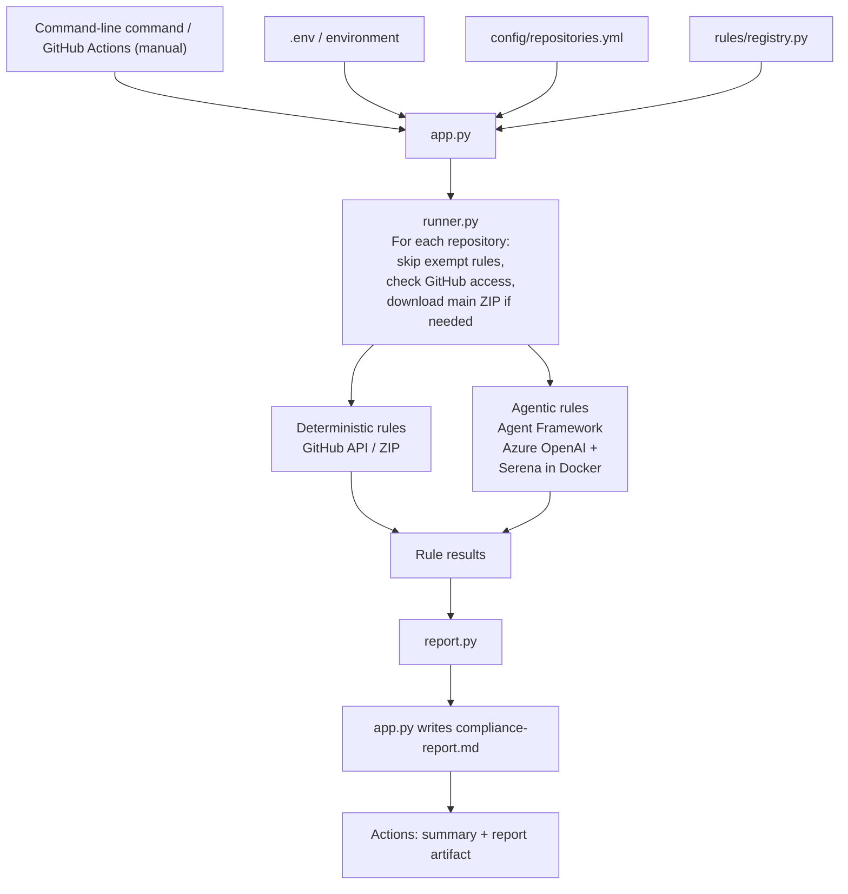

# Architecture

Both local and GitHub Actions runs follow the same path:

- Repositories run in configuration order; rules run in registry order.
- Source rules share one temporary ZIP per repository.
- For AI checks, Serena reads extracted source files in Docker. The Python process sends the prompt and inspected content to Azure OpenAI. Serena has read-only source access and no network access. Temporary files and containers are cleaned up after evaluation.
- Expected check errors become `ERROR` results while other checks continue.
