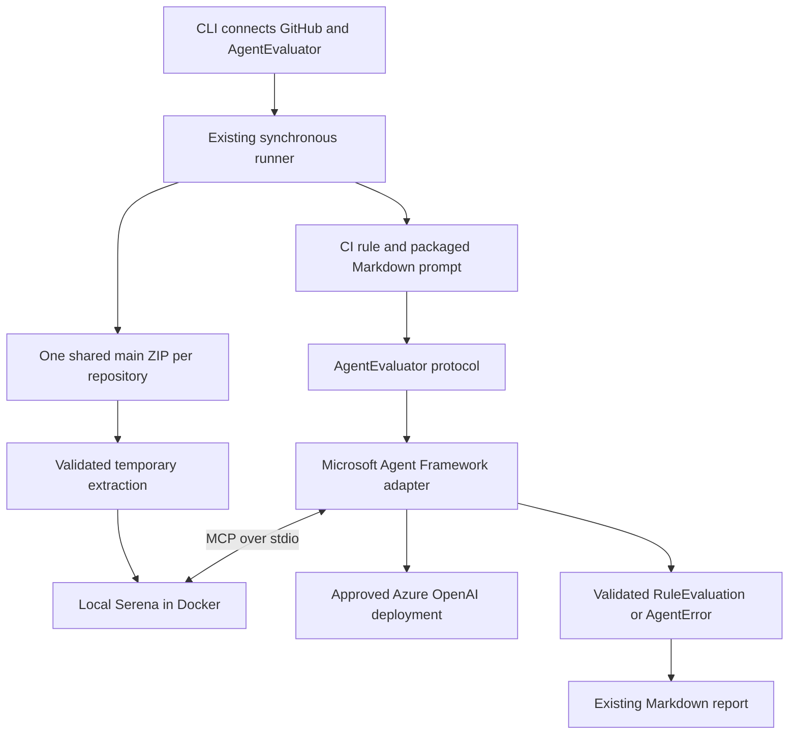

# Architecture

## Overall checker flow

```text
                       START
                         |
          +--------------+--------------+
          |                             |
  GitHub Actions schedule        Developer runs locally
  or manual workflow             `repo-compliance`
          |                             |
          +--------------+--------------+
                         |
                         v
        +---------------------------------------+
        | cli.py                                |
        | Runs the whole check from start to end|
        +---------------------------------------+
             |            |             |
             v            v             v
  +----------------+  +----------+  +------------------+
  | repositories.yml|  | registry |  | GITHUB_TOKEN     |
  | Repositories and|  | Enabled  |  | Access to GitHub |
  | exemptions      |  | rules    |  +------------------+
  +----------------+  +----------+
             |            |
             +-----+------+
                   |
                   v
        +---------------------------------------+
        | runner.py                             |
        | For each repository:                  |
        | 1. applies exemptions                 |
        | 2. checks repository access           |
        | 3. runs each enabled rule             |
        +---------------------------------------+
                   |
          +--------+--------+
          |                 |
          v                 v
  +----------------+  +--------------------------+
  | infrastructure/|  | rules/                   |
  | github/        |  |                          |
  | client.py      |  |                          |
  | Reads settings,|  | One file per compliance  |
  | files, alerts, |  | rule. Source rules inspect|
  | and source ZIP |  | a downloaded source ZIP. |
  +----------------+  +--------------------------+
          |                 |
          +--------+--------+
                   |
                   v
        +---------------------------------------+
        | report.py                             |
        | Turns PASS, FAIL, EXEMPT, and ERROR   |
        | results into Markdown                 |
        +---------------------------------------+
                   |
                   v
             compliance-report.md
                   |
          +--------+--------+
          |                 |
     Local file       Workflow summary
                      and uploaded artifact
```

## Agent evaluation



The rule owns the judgment policy. The runner passes its shared source ZIP and the supplied evaluator through `RuleContext`; exemptions skip evaluation. The adapter owns extraction, asynchronous calls, and resource cleanup. Its Pydantic response model accepts `pass`, `fail`, or `uncertain` plus an explanation and location evidence. Uncertainty and expected integration failures become `AgentError`, which the runner records as `ERROR` before continuing other checks.

Settings are validated when an active rule evaluates. Azure routing and Entra authentication are explicit. Serena receives only temporary source and its own temporary state; source and container filesystems are read-only, networking is disabled, and its tool set is restricted to listing, reading, and searching. Checker-owned project state exists before Serena starts, so Serena cannot fall back to repository-supplied `.serena` configuration. No language servers start. The agent loop times out after 120 seconds; cleanup can take another 10 seconds.

Framework and provider imports stay in [`infrastructure/agentic/agent_framework.py`](../src/repo_compliance/infrastructure/agentic/agent_framework.py). Replacing the framework changes this adapter while preserving `AgentEvaluator`. Azure client construction, Docker launch settings, and Serena configuration each have a small function there. Replacing Serena changes launch configuration and the tool allow-list. The core runner and rule remain unchanged. Safe ZIP extraction lives in [`source_snapshot.py`](../src/repo_compliance/infrastructure/source/source_snapshot.py).

The shared system prompt in `infrastructure/agentic/system_prompt.md` supplies trust, scope, and structured response instructions to every agent evaluation. Rule prompts in `rules/agentic/` supply the judgment criteria and rule-specific evidence requirements. Both are loaded with `importlib.resources`, included in the wheel, and do not depend on the working directory. Normal CI uses fake integrations; separate opt-in checks exercise Docker isolation and live prompt judgments. See the [setup and verification commands](../README.md).

## File responsibilities

- [`.github/workflows/repository-compliance.yml`](../.github/workflows/repository-compliance.yml) schedules the hosted run, supplies the secret token, and publishes the finished report. It does not contain compliance rules.
- [`src/repo_compliance/cli.py`](../src/repo_compliance/cli.py) is the top-level application coordinator. It loads configuration, creates the GitHub client, starts the runner, generates the report, and writes it to disk.
- [`config/repositories.yml`](../config/repositories.yml) is the visible list of repositories and repository-specific rule exemptions.
- [`src/repo_compliance/config.py`](../src/repo_compliance/config.py) reads and validates that list before any checks run.
- [`src/repo_compliance/rules/registry.py`](../src/repo_compliance/rules/registry.py) is the ordered list of enabled rules. Its order becomes the report order.
- [`src/repo_compliance/runner.py`](../src/repo_compliance/runner.py) coordinates checks for each repository, skips exempt rules, confirms repository access when any rules are active, and downloads one main-branch source snapshot when an active rule needs it.
- [`src/repo_compliance/infrastructure/github/client.py`](../src/repo_compliance/infrastructure/github/client.py) contains all communication with GitHub. Rules ask it focused questions instead of making their own web requests.
- [`src/repo_compliance/infrastructure/github/models.py`](../src/repo_compliance/infrastructure/github/models.py) defines shared GitHub response models; response models used by only one rule stay with that rule.
- [`src/repo_compliance/rules/`](../src/repo_compliance/rules/) contains the actual standards, grouped by evaluation method. Each rule lives in its own file.
- [`src/repo_compliance/report.py`](../src/repo_compliance/report.py) converts collected results into `compliance-report.md`.
- [`src/repo_compliance/domain.py`](../src/repo_compliance/domain.py) defines the shared names, data shapes, and `GitHubApi` and `AgentEvaluator` protocols used by rules, the runner, and the report. The CLI supplies the concrete integrations.

The command can enter through the `repo-compliance` script declared in [`pyproject.toml`](../pyproject.toml), or through [`src/repo_compliance/__main__.py`](../src/repo_compliance/__main__.py) when run as a Python module. Both lead to `cli.py`.
